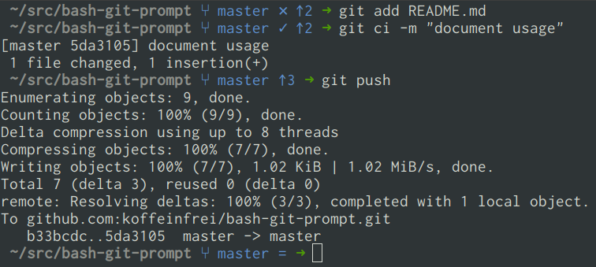

# Git prompt for bash

Bash git prompt written in pure bash script.

Under the hood the [git prompt provided by
git](https://github.com/git/git/blob/master/contrib/completion/git-prompt.sh)
is used. As that script does all the logic already, but outputs a rather
cryptic status line, the only thing this script does is replace the output by
more intuitive icons.



Comparing the output of this script...

```bash
master ✕✓? ↑1↓5
```

...with the original git prompt

```bash
master *+% u+1-5
```

## Usage

1. Download the script
   ```bash
   curl https://raw.githubusercontent.com/koffeinfrei/bash-git-prompt/master/bash-git-prompt > ~/.bash-git-prompt
   ```

1. Add the following to your `.bash_profile` (or `.bashrc` or whatever bash
   initialize script you use):
   ```bash
   # 1. Exposes the function `__git_ps1_improved`
   source ~/.bash-git-prompt

   # 2. Include the function `__git_ps1_improved` in your `PS1`.
   #    This is just an example of a prompt with `\w` outputting your current
   #    directory.
   PS1="\w $(__git_ps1_improved) ➜ "
   ```

## Caption

Symbol   | Meaning
-------- | -------
⑂ master | Current branch
✕        | Unstaged changes
✓        | Staged changes
?        | Untracked files
↑1       | One changeset ahead of remote
↓5       | Five changesets behind remote
=        | No difference to remote
\#       | No HEAD to compare against (usually only happens before initial commit

## See also

[Bash prompt](https://github.com/koffeinfrei/bash-prompt) implements a custom
bash prompt including this custom git prompt.

The initial version of this script was introduced in the blogpost [git bash
prompt](https://www.koffeinfrei.org/2013/07/05/git-bash-prompt/), which
describes the implementation in more detail.
